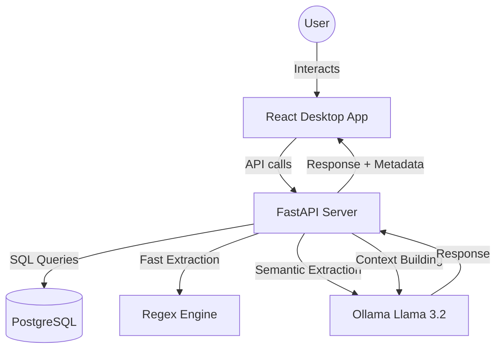

# MemBridge AI — Cognitive Memory Layer for Private Banking

A sophisticated full-stack AI platform designed to provide interactive, memory-aware banking assistance. Powered by a local Llama 3.2 model via Ollama, it features a robust temporal memory engine that extracts, versions, and recalls customer facts in real-time.

**Stack:** React (Vite/TS/JSX) + FastAPI + PostgreSQL + Ollama (llama3.2:3b)

---

## 🌟 Key Features

### 🧠 Advanced Memory Engine
- **Hybrid Extraction:** Combines lightning-fast Regex rules with deep LLM semantic extraction to identify customer facts (income, loan types, eligibility, etc.).
- **Temporal Reasoning:** Tracks fact versions over time. Updates are categorized as `Active` or `Superseded`, allowing you to see how a customer's profile has evolved.
- **Intent-Based Retrieval:** Automatically classifies user intent (e.g., "loan inquiry", "income update") to fetch only the most relevant memory keys for context.
- **Natural Language Context:** Built-in "Context Builder" ensures the AI never sees raw DB values, but instead receives a human-readable summary of the customer's history.

### 🌐 Bilingual & Private
- **Bilingual Support:** Full support for English and Hindi (Hinglish) with automatic language detection.
- **Privacy-First:** All processing happens locally. No data ever leaves your device — no external APIs, no OpenAI/Anthropic dependencies.

### 🖥️ 3-Panel Interactive UI
- **Customer Profile:** Structured view of extracted facts with confidence levels, versioning, and "Time Ago" highlights.
- **Chat Canvas:** Modern chat interface with real-time fact extraction pills, typing indicators, and intent-driven recall suggestions.
- **Memory Timeline:** A chronological audit log of every memory interaction, showing exactly when facts were updated or replaced.

---

## 🏗️ Architecture



---

## 📁 Project Structure

### Backend (`/backend`)
- `main.py`: Entry point with FastAPI endpoints and core chat logic.
- `db.py`: PostgreSQL connection pooling and schema migrations.
- `memory_engine.py`: Logic for upserting, versioning, and retrieving facts.
- `llm_service.py`: Interface for Ollama (llama3.2:3b) for extraction and generation.
- `intent_router.py`: Classifies user messages into banking intents.
- `context_builder.py`: Converts structured facts into natural language context.
- `temporal.py`: Logic for handling chronological memory updates.

### Frontend (`/frontend`)
- `src/App.tsx`: Layout orchestration and state management.
- `src/components/`:
    - `TopBar.jsx`: Identity switching and sync status.
    - `Chat.jsx`: Interactive chat logic with fact highlights.
    - `CustomerProfile.jsx`: Structured fact display with confidence tracking.
    - `MemoryTimeline.jsx`: Chronological log of memory events.
- `src/services/api.js`: Axios-based API client.

---

## ⚙️ Setup & Installation

### 1. Prerequisites
- **Node.js** (v18+)
- **Python** (3.10+)
- **PostgreSQL** (Running on `localhost:5432` with database `membridge`)
- **Ollama** ([Download here](https://ollama.com/download))

### 2. Ollama Setup
```bash
# Pull the model
ollama pull llama3.2:3b

# Ensure it's available locally
ollama run llama3.2:3b
```

### 3. Backend Setup
1. Configure `backend/db.py` with your database credentials.
2. Install dependencies:
   ```bash
   cd backend
   pip install -r requirements.txt
   ```
3. Start the server:
   ```bash
   uvicorn main:app --reload
   ```

### 4. Frontend Setup
1. Install dependencies:
   ```bash
   cd frontend
   npm install
   ```
2. Start the dev server:
   ```bash
   npm run dev
   ```

---

## 🛠️ API Reference

### `POST /chat`
The main interactive endpoint.
- **Input:** `{ "message": "...", "customer_id": "..." }`
- **Output:** `{ "response": "...", "extracted_facts": [...], "intent": "...", "suggestions": [...], "language": "..." }`

### `GET /memory/{customer_id}/profile`
Returns the current active "Key Memory" for a user.

### `GET /memory/{customer_id}/timeline`
Returns the chronological history of all memory updates.

---

## 🛡️ Database Schema
The system automatically initializes two main tables:
1. `memory_facts`: Stores structured JSONB values, confidence scores, and versioning info.
2. `chat_history`: Stores the full dialogue history with metadata for session persistence.

---

© 2026 MemBridge AI — Private, Cognitive, Intelligent.
